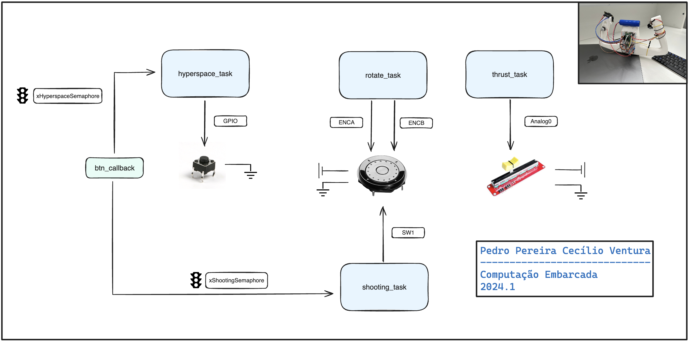

# Controle para Asteroids

Projeto feito em uma rp2040 para a matéria de computação embarcada no insper. 
Segue o diagrama de blocos explicativo do firmware:

Para mais informações vou disponibilizar aqui ao final um [video](https://youtu.be/ct4SKozNZgc) sobre o controle o o link no [Hackaday](https://hackaday.io/project/195786-asteroids-rp2040-controller)!

## No linux

Para conectar o bluetooth no linux usar os passos descritos no site:

- https://marcqueiroz.wordpress.com/aventuras-com-arduino/configurando-hc-06-bluetooth-module-device-no-ubuntu-12-04/
